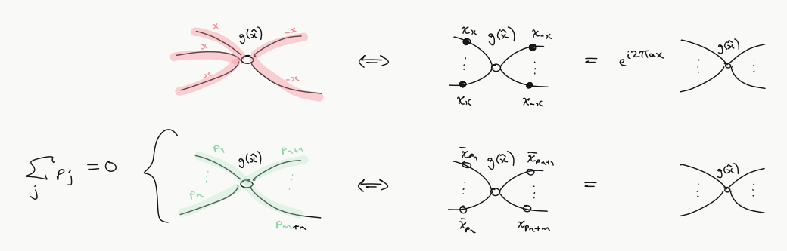
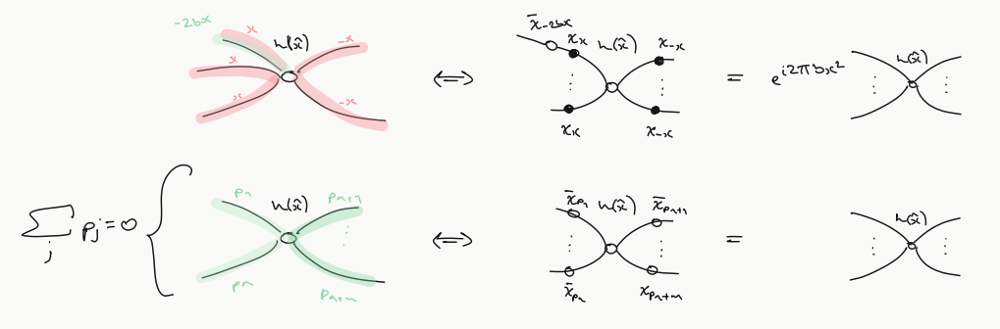
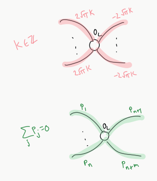

# Focked Up ZX

Throughout, let the hat notation $\hat{x}$ mean $x$ is a variable in some function of $x$. E.g. writing $f(x) = sin(x)$ is equivalent to writing $f = sin(\hat{x})$.
Write $gh$ to be the pointwise product of two functions: $(gh)(x) := g(x) h(x)$.

### Pauli Webs

Let $g = e^{i a 
\hat{x}}$, $h = e^{i b
\hat{x}^2}$ and $f = gh = e^{i (a \hat{x} + b \hat{x}^2)}$ 

#### Gaussian spiders

$g$-spiders:

$h$-spiders:

Holds with colours exchanged.

#### GKP spiders

$O_L$ spiders

TODO: scalars? Write out the iff relation explicitly.

TODO: $1_L$ spiders?

Holds with colours exchanged.

### Measuring displacement operators

TODO: Circuit for measuring any multimode displacement operator. Analogous to one measuring arbitrary Pauli string $X^{a_1} Z^{b_1} \otimes \ldots \otimes X^{a_1} Z^{b_1}$ in qudit case.

### Want to show

- GKP measurements commute. 
  - Would follow from another simpler rule that we haven't yet shown: 
  
  - IIRC this in turn would follow from simpler one involving $p$-spider?
  

